# MatrixRainCostum
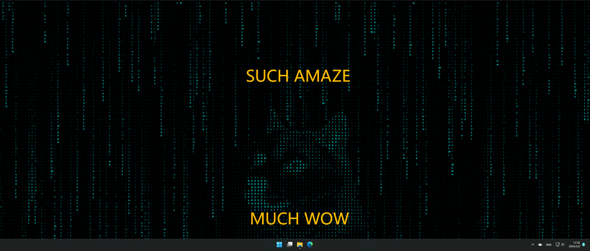
On top of this, https://github.com/bad1dea/lively_matrix

this project adds the ability of custom ASCII image and dynamic interaction with raindrops.
# Tutorial

Download Ascgen2 from https://ascgendotnet.jmsoftware.co.uk/

Download Lively Wallpaper from https://www.rocksdanister.com/lively/

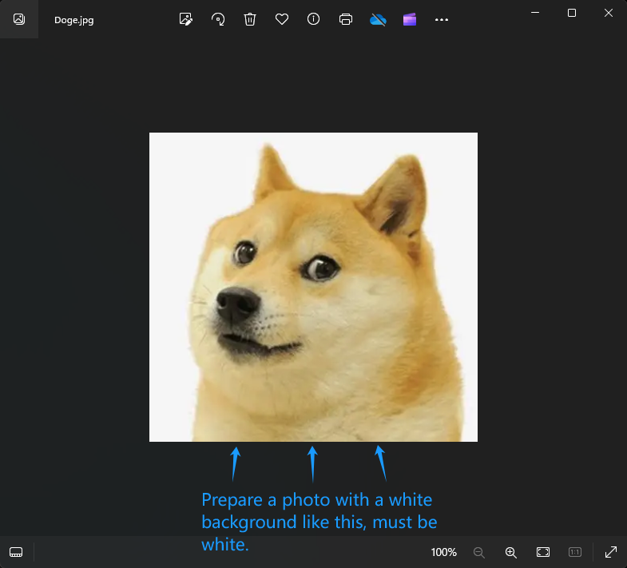
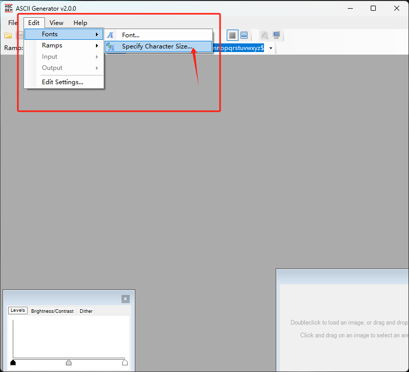
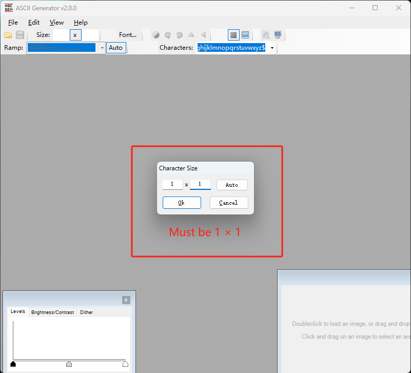
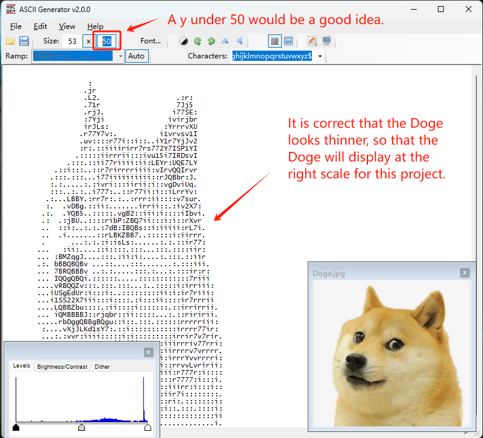
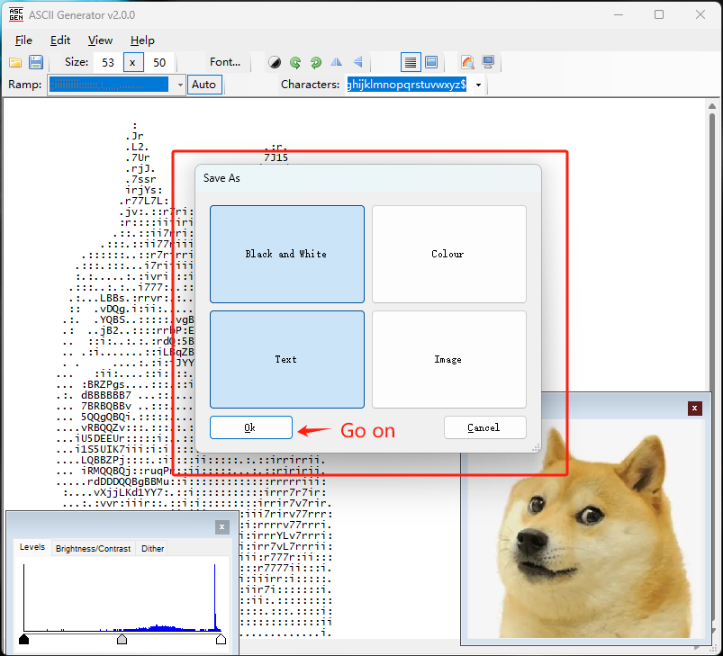
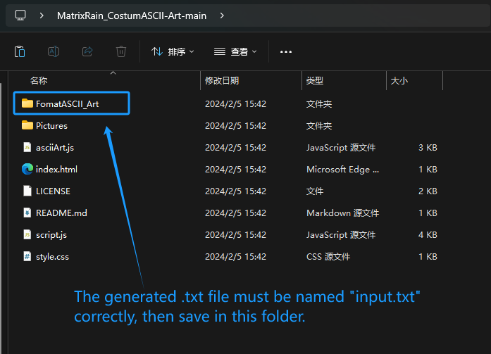
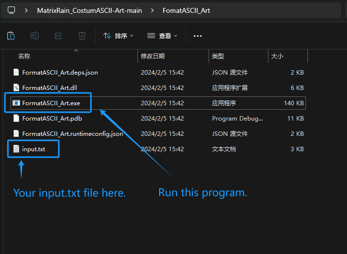
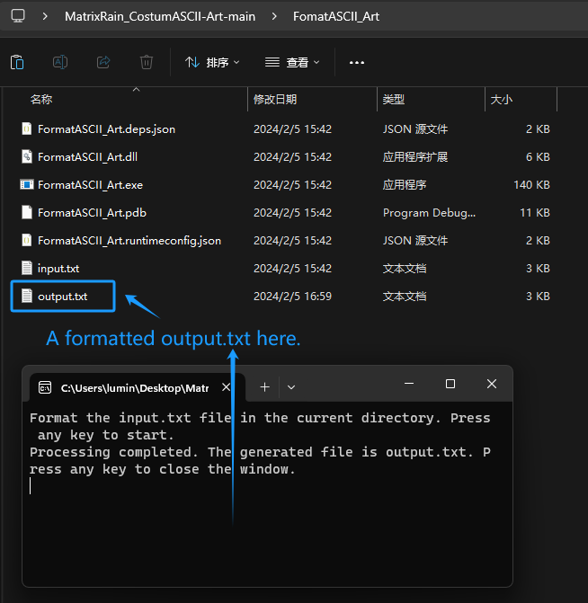
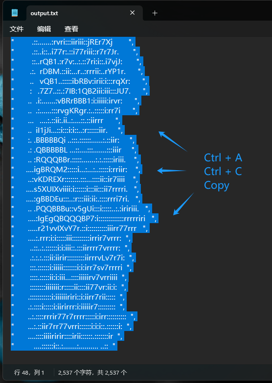
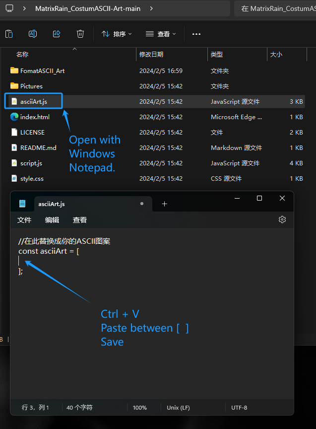
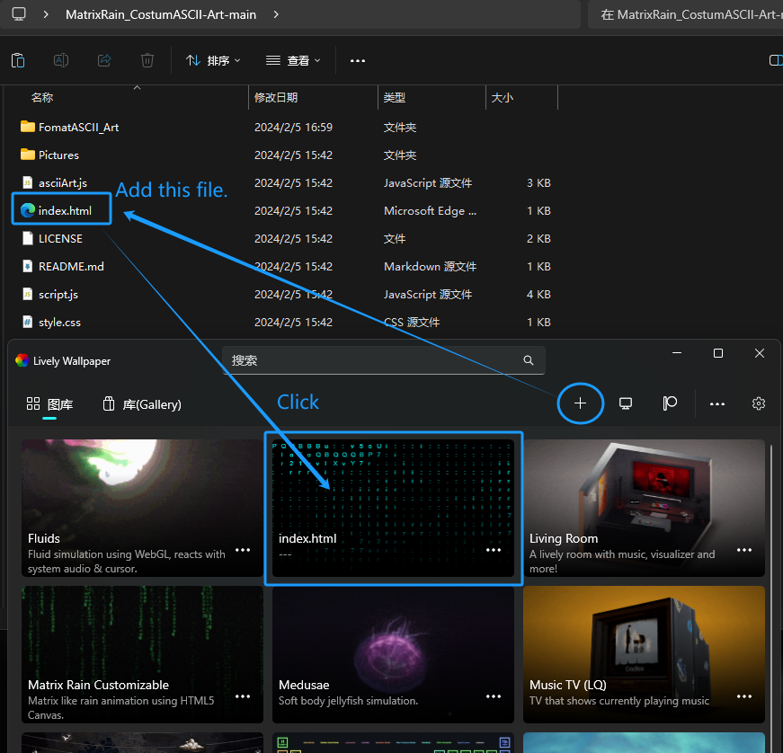

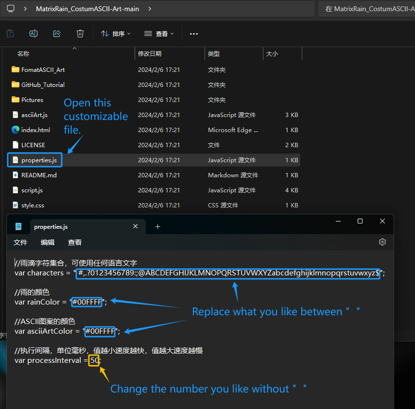
